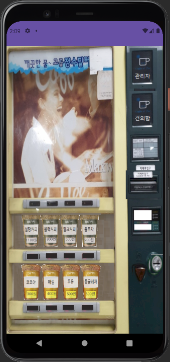
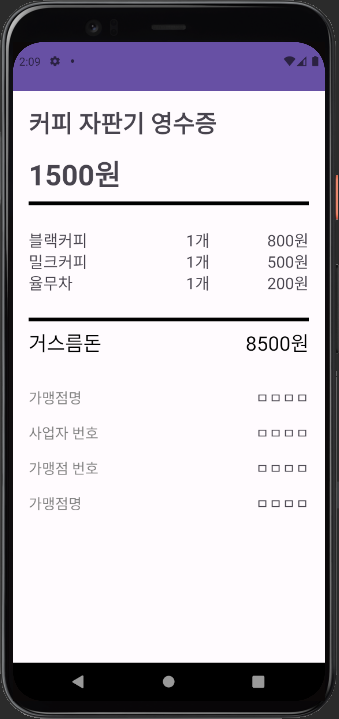
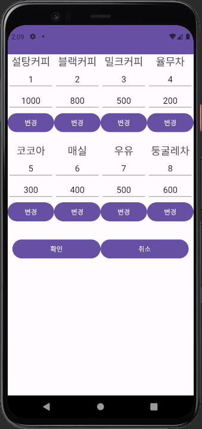

# Bteam(문병준 , 김건호 , 송빛나 , 임유주 )

- 작성일 : 2023-06-27
- 작성자 : 김영문
- 작성내용:
    - 1.개선사항 - 협업관련:
    - **초기 작업 시 프로젝트를 개인별로 따로 만들고** 진행해서 병합 시 어려움이 있었음.
    **초기에 조장이 프로젝트의 기본틀*(package , Project Name 등 ) 을 만들고** 진행하는 방법이 바람직함.
    ⇒ 최종프로젝트 시작 전 팀 Repository를 만들고 **주에 2~3회정도 병합 연습 권고**
    - 2. 개선사항 - 데이터 처리부분 :
    - 위젯들이 반복적으로 사용 된 경우 배열을 이용하였는데 배열 보다는 ArrayList<위젯용DTO>로 묶어서 사용하는것이 조금더 편함. ( 배열 쓴거는 잘했음 )
    
    ```java
    ImageButton btn_insert1, btn_insert2, btn_change, btn_add, btn1, btn2, btn3, btn4, btn5, btn6, btn7, btn8, btn_user;
    
    TextView text_cost1, text_cost2, text_cost3, text_cost4;
    
    ImageButton[] buttons = {btn1, btn2, btn3, btn4, btn5, btn6, btn7, btn8};
            TextView[] textViews = {text_cost1, text_cost2, text_cost3, text_cost4, text_cost5, text_cost6, text_cost7, text_cost8};
    
    ```
    
    - 3. 개선사항 - 네이밍 룰 부분 :
    - CheckPassword , ManageDrink등은 화면을 가진 액티비티임 뒤에 구분자로 Activity또는 Act등 액티비티라는것을 인지할수있는 네이밍룰을 마지막 프로젝트에는 사용하길 권고.
    ResultActivity← 잘함
    
    - 4.개선사항 - 뒤로가기시 처리 
    - 자판기 메인 ⇒ 건의함 ⇒ 자판기메인⇒ 건의함
    이런식으로 화면전환이 계속 되는경우 finish()또는 intent.setFlag가 별도로 없어
    계속해서 액티비티 스택이 쌓이게 되어 뒤로가기를 누르는경우 이전 화면이 계속 나옴.
    ( finish 또는 intent.setFlag부분을 찾아서 넣어보는것을 추천)
    
    그 외에 디자인 부분이나 기타 처리( 자판기 디자인 , 배열 처리 등 )는 대부분 잘 구현 되었음.
    고생하셨습니다.
    
  
    
  
    
  