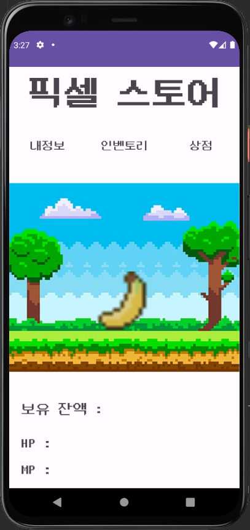
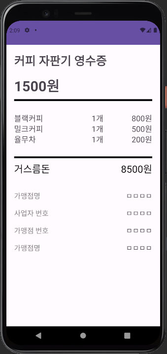

# Cteam(김수봉 , 곽영균 , 이진성 , 조은평 )

- 작성일 : 2023-06-27
- 작성자 : 김영문
- 작성내용:
    - 1. 개선사항 - 미구현부분 :
    - 메인화면에 구매한 목록이나 보유 잔액등의 정보가 표시가 안됨.
    - 인벤토리로 이동 처리 불가. 내부에 코드가 없음.
    
    
    
    - 2.개선사항 - 뒤로가기시 처리 
    - 메인화면 ⇒ 상점 ⇒ 메인화면⇒ 상점
    이런식으로 화면전환이 계속 되는경우 finish()또는 intent.setFlag가 별도로 없어
    계속해서 액티비티 스택이 쌓이게 되어 뒤로가기를 누르는경우 이전 화면이 계속 나옴.
    ( finish 또는 intent.setFlag부분을 찾아서 넣어보는것을 추천)
    
    그 외에 디자인 부분이나 기타 처리(`MenuVal클래스를 이용한 데이터 처리` )는 대부분 잘 구현 되었음.
    고생하셨습니다.
    
    
    
    